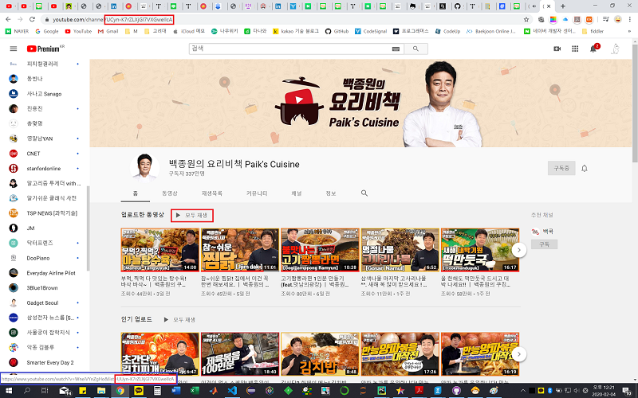
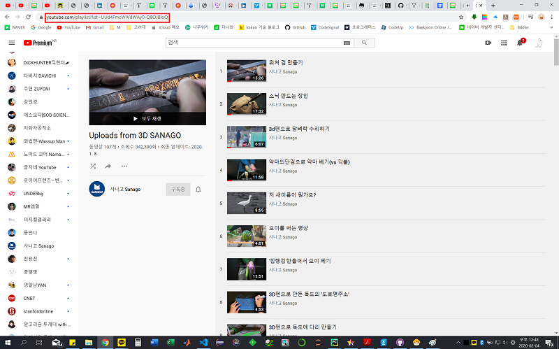
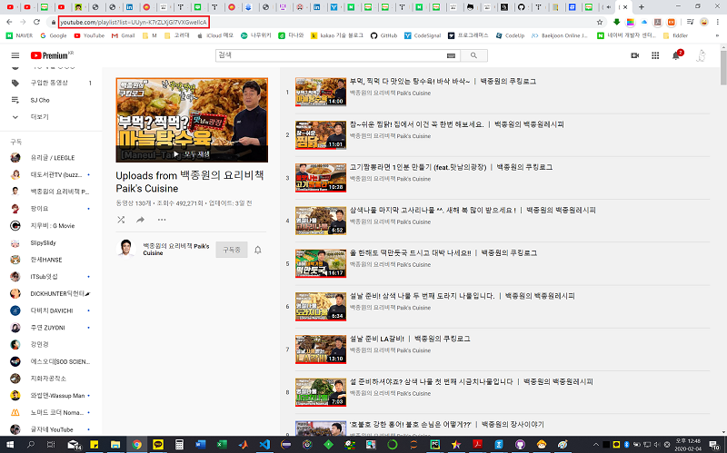
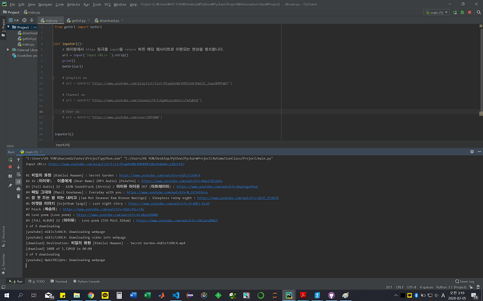
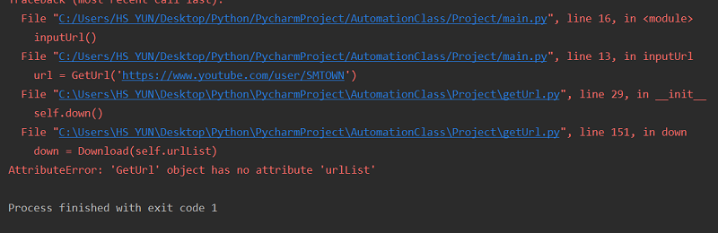

# Python_AutomationClass_Project (2018270819 윤호승)

이 문서는 파이썬 자동화 교육의 최종 프로젝트에 대한 보고서이다.

소스 코드는 [https://github.com/dbsghtmd99/Python_AutomationClass_Project](https://github.com/dbsghtmd99/Python_AutomationClass_Project) 에서 확인 가능하다.

## 1. 개요 및 작동 원리
유튜브의 재생목록, 채널의 주소만 입력하면 재생목록의 모든 영상 또는 채널의 모든 영상을 .mp4 파일로 다운로드 받을 수 있다.

작동 원리는 beautifulSoup 라이브러리로부터  parsing 해온 html 정보를 분석하여 동영상의 url정보를 얻어낸 후, 유튜브 동영상을 다운로드 해주는 모듈에 적용하여 .mp4 파일로 다운로드 되는 방식이다.

## 2. 프로젝트 설명
### 2.1. 개발 환경 및 요구 라이브러리
코드를 실행시키기 전, Anaconda Prompt 를 실행시켜 다음의 라이브러리를 설치해야 한다.
 - bs4 : html parsing 기능 제공 (beautifulSoup)
 - [youtube-dl](https://github.com/ytdl-org/youtube-dl) : 유튜브 링크를 통한 다운로드 기능 제공
 - ~~selenium~~

Python 내장 모듈은 다음과 같다.
 - os : 새로운 폴더 생성, 디렉토리 지정 기능 제공
 - shitil : 다운로드된 파일을 이동 시켜주는 기능 제공
 - datetime : 현재 시간 정보를 불러와 다운로드된 파일을 이동 시킬 폴더의 이름을 설정하는 기능 제공

또한 다음과 같은 환경에서 정상 작동을 확인하였다.
 - conda 4.7.12
 - Python 3.7

### 2.2. 유튜브의 링크 구조에 대한 이해

이 부분에서는 현재 유튜브가 가지고 있는 Url 구조에 대해 알아볼 것이다. 

#### 2.2.1. 일반적인 동영상 Url
일반적으로 유튜브 동영상 Url을 복사하면 다음과 같은 형태일 것이다.

https://www.youtube.com/watch?v=UuV2BmJ1p_I

즉 , https://www.youtube.com 에 /watch?v=UuV2BmJ1p_I 라는 해당 동영상의 고유한 ID를 추가시켜 해당 영상으로 이동되는 방식이다.

좀 더 자세하게 이러한 동영상들의 정보가 여러개 있는 재생목록이나 유튜브 채널에 대해서도 알아보자.

#### 2.2.2. 재생목록의 Url
재생목록의 Url 을 확인 해보면 다음과 같다.

https://www.youtube.com/playlist?list=PLwpDa9WrkRDRXRidbaSoWaXecj1BzFIbJ

마찬가지로 https://www.youtube.com/playlist?list= 에 재생목록의 고유 ID 가 추가되어 해당 재생목록으로 이동 될 수 있는 구조이다.

#### 2.2.3. 채널
유튜브 채널의 링크는 보통 두 가지 형식을 띄고있다.

https://www.youtube.com/channel/UCtckgmUcpzqGnzcs7xEqMzQ 또는

https://www.youtube.com/user/SMTOWN

첫 번째의 경우는 쉽게 채널의 ID가 무엇인지 눈치 챌 수 있을 것이다. 

그러나 실제 채널의 ID는 UCtckgmUcpzqGnzcs7xEqMzQ 가 아닌 tckgmUcpzqGnzcs7xEqMzQ 인데, (UC가 제외되었다.) UC 란 아마도 UserChannel 의 약자일 것이고, 

이것은 여러 채널들을 돌아다니며 채널 주소와 재생목록의 주소를 비교하여 UC 다음의 문자열이 실제 채널의 ID로 표현되는 규칙을 찾아내었다.

두 번째의 경우는 채널의 고유한 ID가 숨겨져 있다.

보통 연예인 소속사 대표 채널이나 뉴스 채널 등 대규모 채널의 경우 이러한 방식으로 Url을 표시한다. 때문에 html 정보를 분석하여 숨겨진 고유ID를 찾아야 한다. 

이 방법에 대해서는 2.3.2. 의 findUrlFromUser() 메소드에서 더 자세히 다룰 것이다.

실제로 위의 메소드를 실행시키면 UCEf_Bc-KVd7onSeifS3py9g 라는 값을 찾아낼 수 있다. 

이것은 https://www.youtube.com/channel/UCEf_Bc-KVd7onSeifS3py9g 라는 url은 https://www.youtube.com/user/SMTOWN 와 SMTOWN 이라는 같은 채널을 보여준다는 말과 같고, 실제로 직접 Url에 접속하면 같은 창을 로드하는 것을 확인해 볼 수 있다. 

또한 마찬가지로, 실제 채널의 ID 는 앞의 UC를 제외한 Ef_Bc-KVd7onSeifS3py9g 이다.

채널의 고유 ID를 찾아내는 방법을 알았으면 이제 채널의 모든 동영상을 어떻게 불러오는지 알아보자.

유튜브에서는 채널이 업로드한 모든 동영상을 하나의 재생목록을 만들어 재생 시켜주는 기능이 제공된다. 채널의 홈 화면에 나와있는 '업로드한 동영상 > 모두 재생'이 이 기능을 수행한다.

다음의 사진들은 여러 채널들을 방문하여 '모두 재생'의 버튼에 마우스 커서를 갖다 댄 후 이 버튼의 링크를 파란색 네모박스로 표시해둔 사진이다. 파란색 네모박스 안의 빨간색 네모박스와 채널의 Url부분의 빨간색 네모박스를 비교해보자.





이 외에도 수많은 채널들을 방문 해본 결과, 채널의 Url이 UC + '채널의 고유ID' 라고 표현되듯 '업로드한 동영상 모두 재생'의 기능을 수행하는 Url은 모두 다음과 같은 형식의 Url으로 구성되었다.

> UC + '채널의 고유 ID'

즉, 채널의 Url로부터 채널의 고유 ID를 알아내면 채널의 모든 동영상을 재생시켜주는 재생목록의 Url도 알 수 있을 것이다.

2.2.2. 로부터 재생목록의 Url이 어떻게 구성 되었는지 되짚어보자.

그러면 UC + '채널의 고유 ID' 라는 문자열이 재생목록의 고유 ID 라고 가정 후 https://www.youtube.com/playlist?list= 의 뒤에 이 값을 넣는다면 채널의 모든 동영상이 저장된 재생목록으로 이동하는 Url을 찾을 수 있을 것이다.

이것을 위의 세가지 예시에 적용하게 되면,






모두 구하고자 하는 재생목록이 나왔음을 알 수 있다. 이제 이 재생목록을 다운로드 받는다면, 채널의 모든 동영상을 다운로드 받을 수 있을 것이다.

### 2.3. 코드 설명

#### 2.3.1. Main Class
main Class 는 사용자로부터 Url을 입력받고 GetUrl 클래스를 불러오는데 사용한다.

```python
from getUrl import GetUrl


def inputUrl():
    # 파이참에서 https 링크를 input을 return 하면 해당 웹사이트로 이동되는 현상을 방지합니다.
    url = input('Input URL>> ').strip()
    print()
    GetUrl(url)

    # playlist ex
    # url = GetUrl('https://www.youtube.com/playlist?list=PLwpDa9WrkRDSz6klKmGlI_tuwt8HMfmb7')

    # Channel ex
    # url = GetUrl('https://www.youtube.com/channel/UCtckgmUcpzqGnzcs7xEqMzQ')

    # User ex
    # url = GetUrl('https://www.youtube.com/user/SMTOWN')


inputUrl()
```
<br>
<br>
<br>
<br>

#### 2.3.2. GetUrl Class
GetUrl 클래스는 main 으로부터 입력된 Url을 바탕으로 동영상의 Url이 담긴 list를 찾아낸 뒤, 다운로드를 수행하는 클래스이다.

```python
import requests
from bs4 import BeautifulSoup as bs
from download import Download
import youtube_dl


class GetUrl(object):
    # main class로부터 입력된 재생목록의 url을 받아옵니다.
    def __init__(self, Url):
        urlList = []
    # 'https://www.youtube.com/playlist?list=PLwpDa9WrkRDRXRidbaSoWaXecj1BzFIbJ' 와 같은경우
        if 'list' in Url.split('.com/')[-1]:
            self.playListUrl = Url
            self.urlList = self.findUrlFromPlaylist()
            self.down()

    # 'https://www.youtube.com/channel/UCd4FmcWIVdWAy0-Q8OJBloQ' 와 같은경우
        elif 'channel' in Url.split('.com/')[-1]:
            self.channelUrl = Url
            self.findUrlFromChannel()
            self.urlList = self.findUrlFromPlaylist()
            self.down()

    # 'https://www.youtube.com/user/SMTOWN' 과 같은경우
        elif 'user' in Url.split('.com/')[-1]:
            self.userUrl = Url
            self.findUrlFromUser()
            self.urlList = self.findUrlFromPlaylist()
            self.down()

        # 일반적인 동영상인 경우
        else:
            with youtube_dl.YoutubeDL({}) as ydl:
                ydl.download([Url])

    # 재생목록에 있는 동영상들의 정보를 받아옵니다.
    def findUrlFromPlaylist(self):
        # playListUrl의 html정보를 읽어옵니다.
        html = requests.get(self.playListUrl)
        soup = bs(html.text, 'html.parser')
        html.close()

        # 동영상들의 제목과 url을 추출합니다.
        videoTitle = soup.findAll('tr', {'class': 'pl-video yt-uix-tile'})
        videoLinks = soup.findAll('a', {'class': 'pl-video-title-link '
                                                 'yt-uix-tile-link yt-uix-sessionlink spf-link'})

        # 재생목록이 비어있거나 비공개로 설정된 경우
        if len(videoTitle) == 0 or len(videoLinks) == 0:
            print('재생목록이 비어있거나 비공개로 설정되어 있습니다.')
            print('실행을 종료합니다.')
            exit(0)

        # 정상적으로 불러온 경우
        try:
            titleList = []
            urlList = []
            # print('제목 추출중...')
            for title in videoTitle:
                YTtitle = title.get('data-title')
                titleList.append(YTtitle)
                # print(YTtitle)
            # print('url 추출중...\n')
            for link in videoLinks:
    # 재생목록의 정보가 담긴내용은 삭제한 후, 순수한 동영상의 링크만을 가져옵니다.
    # 즉, https://www.youtube.com/watch?v=eGXJs7zOHC4&list=PLwpDa9WrkRDRXRidbaSoWaXecj1BzFIbJ&index=2&t=0s
    # 에서 https://www.youtube.com/watch?v=eGXJs7zOHC4 만을 split 함수를 통해 추출합니다.
    # print(link.get('href').split('&')[0]) (i.e. /watch?v=gb1tnmgPEFo)
                YTurl = 'https://www.youtube.com' + link.get('href').split('&')[0]
                urlList.append(YTurl)
                # print(YTurl)

            for num, i in enumerate(range(len(titleList))):
                print('#' + str(num + 1), titleList[i], ':', urlList[i])

        except Exception as e:
            print(e)

        return urlList

    # 원하는 채널의 영상의 정보를 모두 가져옵니다.
    def findUrlFromChannel(self):
        # 채널 Url로부터 채널 ID를 추출합니다.
        channelID = self.channelUrl.split('channel/')[-1][2:]  # tckgmUcpzqGnzcs7xEqMzQ
        playListID = 'UU' + channelID  # UUtckgmUcpzqGnzcs7xEqMzQ

        playAllVideosUrl = 'https://www.youtube.com/playlist?list=' + playListID
        self.playListUrl = playAllVideosUrl
    # print(self.playListUrl)  # https://www.youtube.com/playlist?list=UUtckgmUcpzqGnzcs7xEqMzQ
    # # https://www.youtube.com/watch?v=Ja0ioh5l3Y0 로부터 /watch?v=Ja0ioh5l3Y0 만 추출합니다.
    # firstVideoID = self.findUrlFromPlaylist()[0].split('.com')[-1]
    # # print(firstVideoID)
    # realURL = 'https://www.youtube.com' + firstVideoID + '&list=' + playListID
    # print(realURL)  # https://www.youtube.com/watch?v=Ja0ioh5l3Y0&list=UUtckgmUcpzqGnzcs7xEqMzQ


    # 원하는 채널의 영상의 정보를 모두 가져옵니다.
    def findUrlFromUser(self):
        # userUrl의 html정보를 읽어옵니다.
        html = requests.get(self.userUrl)
        soup = bs(html.text, 'html.parser')
        html.close()

        # '모두 재생' 버튼에 담긴 정보를 가져옵니다.
        userLinks = soup.findAll('a', {'class': 'yt-uix-sessionlink yt-user-name spf-link'})
        # print(userLinks)
    
    
    # 맨앞의 href 만 필요하기 때문에 iterator 인 userLinks 에 반복문을 적용하지 않고
    # 다음과 같이 userLinks.__iter__().__next__() 를 사용하여 첫번째로 나오는 부분만 추출합니다.

    # print(userLinks.__iter__().__next__().get('href'))  # /channel/UCaO6TYtlC8U5ttz62hTrZgg

        # 마찬가지로 UC xxxx의 형태를 추출하기 위해
        userID = userLinks.__iter__().__next__().get('href').split('channel/')[-1][2:]
        playListID = 'UU' + userID
        playAllVideosUrl = 'https://www.youtube.com/playlist?list=' + playListID
        self.playListUrl = playAllVideosUrl
        # print(self.playListUrl) # 재생목록 링크


    # Download 클래스로부터 urlList 안의 url들에대해 일괄적으로 다운로드를 시작합니다.
    def down(self):
        down = Download(self.urlList)
        down.multiDown()
```
#### 2.3.3. Download Class
Download 클래스는 youtube_dl 라이브러리를 이용하여 다운로드를 하고, 다운로드된 파일들을 관리하는 클래스이다.

```python
import datetime
import os
import shutil
import youtube_dl


class Download(object):

    def __init__(self, url):
        self.url = url

    def multiDown(self):

        # 다운로드 될 폴더의 이름을 현재 시간을 바탕으로 가져옵니다.
        d = datetime.datetime.today()
        newFolderName = "{:02d}{:02d}{:02d}_{:02d}{:02d}{:02d}".format(d.year, d.month, d.day, d.hour, d.minute,
                                                                       d.second)
        # print(type(newFolderName))  # str인지 확인
        # print(newFolderName)  # 정상 출력 확인


        # 폴더를 만들기 전 이름이 중복되는지 확인합니다.
        if not os.path.isdir(newFolderName):
            os.mkdir(newFolderName)
        else:
            print('같은 이름의 폴더가 이미 존재합니다.')
            exit(0)


        # 각각의 url마다 다운로드를 시작합니다.
        for num, url in enumerate(self.url):
            # youtube_dl options
            ydl_opts = {
                # 'format': 'best/best',  # 가장 좋은 화질로 선택(화질을 선택하여 다운로드 가능)
                # 'outtmpl': self.path  # 다운로드 경로 설정 (환경변수 설정 문제로 인하여 설정 불가)
                # 'writesubtitles': 'best',  # 자막 다운로드(자막이 없는 경우 다운로드 X)
                # 'writethumbnail': 'best',  # 영상 썸네일 다운로드
                # 'writeautomaticsub': True,  # 자동 생성된 자막 다운로드
                # 'subtitleslangs': 'en'  # 자막 언어 설정
            }
            try:
                # 다운로드 진행 상태를 출력합니다.
                print(num + 1, 'of', str(len(self.url)), 'downloading')
                with youtube_dl.YoutubeDL(ydl_opts) as ydl:
                    ydl.download([url])

            except Exception as e:
                print(e)


        # 다운로드가 끝난 mp4 파일을 지정된 폴더로 이동합니다.
        file = os.listdir('.\\')
        for i in file:
            temp = i.split('.')
            if temp[-1].lower() == 'mp4':
                shutil.move('.\\' + i, '.\\' + newFolderName + '\\' + i)

```
## 3. 실행 결과

### 3.1. 재생목록을 다운로드 할 때

아래의 재생목록을 다운로드 해보겠다. 이때, 재생목록은 '공개' 상태 여야하며, '일부 공개' 또는 '비공개' 의 경우는 html 정보를 불러오지 못하기에 정상적으로 작동되지 않는다.


<br>

코드를 실행 시켰을 때의 화면이다. 

Pycharm에서 입력을 받을 때 링크를 입력하게 되면 그 웹사이트로 이동되는 경우가 있어서 이를 막기 위해 처음에 입력을 할 때 링크 Url을 붙여넣기 한 후 공백을 하나 삽입 해주어야 한다.


동영상을 불러오고 다운로드 중인 모습



다운로드가 끝난 후 새로운 폴더에 동영상들이 저장 되어있다.


<br>
<br>
<br>

### 3.2. 채널을 다운로드 할 때 (/channel 인경우)

이번에는 아래의 채널을 다운로드 하도록 하겠다.


<br>
<br>

커맨드 창에 채널의 Url을 입력하고 다운로드 중인 모습이다. 

이때 https://www.youtube.com/channel/UCnd-UJ1zLLW6fGYaRl39APg/featured 가 아닌

https://www.youtube.com/channel/UCnd-UJ1zLLW6fGYaRl39APg 를 입력해야 함에 주의해야한다.


<br>
<br>
<br>
<br>
<br>

다운로드가 끝난 후 동영상들이 저장 된 모습


<br>
<br>
<br>
<br>
<br>
<br>

## 4. 토의

### 4.1. 코드 작성 중 발생했던 에러 분석

1. AttributeError: 'GetUrl' object has no attribute 'urlList'



다음의 부분에서 highlighted 된 부분의 코드를 작성하지 않아서 에러가 발생했다. 


findUrlFromUser() 메소드에서 self.playListUrl 의 값을 지정해주면 해당 채널의 모든 동영상이 담긴 재생목록의 Url을 받아올 수 있는데, 

이 재생목록으로부터 동영상들의 Url이 담긴 list를 받아오지 않고 down()메소드를 실행했다.

down() 메소드는 self.urlList 에 저장된 동영상 list 들의 url 을 바탕으로 다운로드를 실행하는 메소드인데, 이 list의 값이 초기화 되지 않은 채로 즉, 

```python
(self.urlList = None) 인 상태로
```

down()을 calling 해버렸기 때문에 결국 에러가 발생했다.

그래서 self.urlList의 값을 재생목록의 Url로부터 동영상들의 리스트를 반환하는 findUrlFromPlayList() 메소드로 self.urlList의 값을 할당 해주고, 다시 확인해보니 정상적으로 작동되었다.

<br>

2. TypeError: expected string or bytes-like object
   
   현재 시간을 바탕으로 저장될 폴더 이름을 만들 때, datetime 모듈로부터 불러온 날짜/시간 정보가 str type이 아닌채로 makedir 메소드를 실행시켜서 발생했다. (makedir의  폴더이름 parameter로는 string type가 와야하기 때문이다.)
   
   그래서 불러온 시간정보를 str() 을 이용하여 type casting 하고 다시 실행하니 정상 작동 하였다.

<br>

3. 재생목록의 동영상이 100개를 초과하는 경우
   
   다음의 사진과 같이 유튜브에서는 메모리를 절약하기 위해서 자체적으로 재생목록의 모든 영상을 불러오지 않고, 상위 100개만 html에 포함시킨다. 


위와 같이 사용자가 100번째 영상까지 스크롤을 내리면 유튜브는 동영상을 다시 로드하는데, 문제는 html을 가져올 때 이것이 로드 되지 않은채로 html을 가져오기 때문에 최대로 다운로드 받을 수 있는 동영상의 개수가 100개로 제한 되어있다.

문제를 해결할 수 있는 방법은 찾았지만 이는 4.2.1. 에서 설명한다.


### 4.2. 추가 활용 방안

다음의 내용들은 추가적으로 구현 해 볼 만한 기능 이였지만, 보고서 제출 기한이 앞당겨져서 구현하지 못한 내용들을 다룬다.

#### 4.2.1. selenium 라이브러리를 이용하여 100개 이상의 동영상을 다운로드 할 수 있게하기

selenium 라이브러리는 스스로 인터넷 창을 열어 원하는 기능을 자동으로 제어 할 수 있는 기능을 제공한다.

위에서 말했듯이 100개 이상의 동영상의 Url을 얻기 위해 selenium 으로 101번째 부터의 동영상을 로드하도록 제어한 다음, 이를 다시 beautifulSoup 라이브러리로 동영상 정보를 얻어내어 다운로드 하면 구현 할 수 있을 것 이다.

<br>

#### 4.2.2. 다운로드 받은 .mp4 파일을 .mp3으로 변환해주는 기능

moviepy 라는 라이브러리를 이용하여 동영상 파일을 음악 파일로 변환 시킬 수 있다. 

<br>

### 4.3. 여담

사실 youtube-dl 모듈 하나만으로도 위의 기능을 모두 구현 할 수 있다. 하지만 배운 내용들을 최대한 활용하여 직접 만들어 보는 것이 의미가 있기에 새로 코드를 작성하였다.